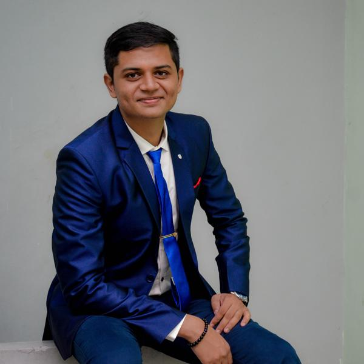

# About Me
I am a Robotics and Automation Engineer from Worcester Polytechnic Institute(Graduation in May 2024) with industry experience in Product Ideation to Market Ready since 2018 in field of Embedded Systems and Automation Systems.

# Robotics Engineer and Product Developer

> **Email**: [parth.pmech@gmail.com](mailto:parth.pmech@gmail.com)
> **Degree**: Masters in Robotics and Automation Engineering

I am a Graduate in Robotics and Automation Engineering from Worcester Polytechnic Institute with an undergraduate in Electrical Engineering from Pandit Deendayal Energy University (formerly Pandit Deendayal Petroleum University). My research interest lies in the areas of Embedded Systems, Control Systems, Robot Localization, Motion Planning and Reinforcement Learning.  
I am currently working on Sensor-Fusion of IMU, Monocular Camera and LIDAR (Visual Inertial LIDAR Odometry). I have experience in Camera Calibration, and Visual SLAM. I am actively looking for full time opportunities.  
During my masters, I worked on a fully funded and paid project with the Executive Director of Academic and Research Computing, Mr. Siamak Najafi at WPI to develop a platform to create a mobile robot platform for create easy and autonomous 3D Scans of environment for visualizing and virtual touring.  
Currently, I am working at DEKA Research and Development as a Controls Systems Engineering Intern. My responsibilities includes robust camera calibration pipeline, developing Controls Algorithm for developing Neural Nets using Supervised Learning and using computer vision based manufacturing detect testing algorithms. In my spare time I like to workout at Gym, work on automation projects, read non-fiction and watch Sitcoms!

# Resume

## Professional Experience
### Control Systems Engineer, *DEKA Research and Development*
- Improved an analytical closed-loop insulin control system by integrating multi-threading capabilities in C++ for machine learning model training, after adapting the system for Linux compatibility. This enhancement achieved a significant 96.7% reduction in runtime.
- Developed PLC systems cabinets with communication protocols like Ethernet, USB, RS-232, and RS-485 for an automated assembly line aimed at Quality Assurance for biomedical devices which improved quality identification accuracy by 18% and reduced part rejection cost by 16% per unit.
- Developed a Simulator for Type 1 Diabetic Patients to model meal-insulin response essential for developing a controller-based insulin pump using ANSI C. Ensured cross-platform compatibility, conducted unit testing, and improved data collection speeds by 840% and reduced research cycle time by 98.6%.
- Developed C++/ROS based Robust and Self Correcting tightly coupled LIDAR, Vision and IMU Based Algorithm for Autonomous Simultaneous Localization and Mapping (SLAM) for x86 Architecture with improved algorithm performance by CPU Load Balancing using Parallel Processing on Frame Data, reducing processing time by 23%
### Computational Scientist, *Worcester Polytechnic Institute*

### Augmented Reality Developer

### Embedded Systems Engineer

### Embedded Systems Engineer, *Dash Dot Robotics*
