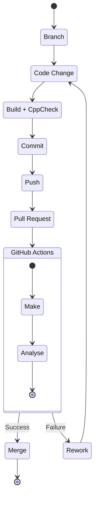

# Design from Scratch using Custom Makefiles and Register Programming

## Makefile + Toolchain based Compilation

> Guide: - Microcontroller Programming without IDE (Makefile + Toolchain) - Build and
Flash your Microcontroller Project from the Command-line with a
Makefile
> 

**Why would you even need a custom toolchain?** -
Proprietary Toolchain can be expensive. - You cannot automate a lot of
processes in propriertary toolchain as they need to be done using mouse
input which might be an issue when automated testing needs to be
configured on cloud or local desktop. - Support can be limited due to
expenses or permission to user to edit it. - Less control over
compilation due to Proprietary code.

*:notebook: For our usage, we are working on MSP430 here. So we
will be using the toolchains related to it. The open source alternative
that we are using is **gcc**.*

### Fetch appropriate toolchain

1. Download the gcc toolchain for MSP430 from website [here](https://www.ti.com/tool/MSP430-GCC-OPENSOURCE). (I
suggest to download the version with support files included. This will
avoid the hassel of setting up everything personally)
2. I tend to use multiple microcontroller so we want to seperate
toolchains from each other to avoid confusion and have an easy access.
So I tend to store my toolchains in `~/dev/tools/`
folder.
    
    The zip file is downloaded in `~/Downloads/`. So:
    
    1. Unzip the file
    2. Create a folder to store the toolchains if non-existent and move
    this toolchain there.
        
        ```bash
            mkdir -p ~/dev/tools
        ```
        
    3. Open the folder and run the file using
        
        ```bash
        sudo ./*.run
        ```
        
        Use the `/dev/tools` as the install directory for easy
        managing.
        
    4. Add the toolchain to path.
    `bash cd ~/dev/tools/msp430-gcc/bin/ export PATH="$PATH:$(pwd)"`
    Doing this will add the MSP430 GCC Compiler to your path which can be
    called easily using `msp430-elf-gcc` command from anywhere in
    the system so you don’t need to call the file from the actual path
    everytime.

### Configure the toolchain

### Basic Compilation

If you try to run the code:

```bash
msp430-elf-gcc main.c
```

You will recieve the following error:

```bash
main.c:53:10: fatal error: msp430.h: No such file or directory
   53 | #include <msp430.h>      |          ^~~~~~~~~~compilation terminated.
```

This is due to the fact the compiler does not know currently where
the headers for the chip is located. We need to provide the compiler
with those details. You can find `msp430.h` using:

### Finding the Necessary Header
Files

```bash
cd ~/dev/tools/msp430-gcc
find -name "msp430.h"
```

This will output the relative location of the file which in this case
is:

```bash
./include/msp430.h
```

Go to the folder where msp430 lies and get the path of the file
using:

```bash
cd include
pwd
```

This will output the absolute path of `msp430.h`:

```bash
/home/ws/dev/tools/msp430-gcc/include
```

Copy this path and go back to the folder which contained
`main.c` and use the `-I` include flag to include
this folder for compilation:

```bash
msp430-elf-gcc -I /home/ws/dev/tools/msp430-gcc/include main.c
```

This will generate a new set of errors:

```bash
msp430-elf-gcc -I /home/ws/dev/tools/msp430-gcc/include main.c
main.c: In function 'main':
main.c:58:5: error: 'WDTCTL' undeclared (first use in this function)   58 |     WDTCTL = WDTPW + WDTHOLD;                 // Stop watchdog timer
      |     ^~~~~~main.c:58:5: note: each undeclared identifier is reported only once for each function it appears in
main.c:58:14: error: 'WDTPW' undeclared (first use in this function)   58 |     WDTCTL = WDTPW + WDTHOLD;                 // Stop watchdog timer
      |              ^~~~~main.c:58:22: error: 'WDTHOLD' undeclared (first use in this function)   58 |     WDTCTL = WDTPW + WDTHOLD;                 // Stop watchdog timer
      |                      ^~~~~~~main.c:59:5: error: 'P1DIR' undeclared (first use in this function)   59 |     P1DIR |= 0x01;                            // Set P1.0 to output direction
      |     ^~~~~main.c:63:9: error: 'P1OUT' undeclared (first use in this function)   63 |         P1OUT ^= 0x01;                        // Toggle P1.0 using exclusive-OR
      |         ^~~~~
```

This are the set of declaration which are missing. This issue occurs
because when manufacturer creates a header file, they create it for a
large number of variant. MSP430 has more than 1 variant with different
internal structure. Creating seperate headers for each would be a
nightmare to manage. So, the developers used macros to segregate
specific versions of mcu from a single header file.

### Specify the MCU Version

Solution: - The version of mcu can be specified either by adding a
`#define <mcu-version>` in the msp430.h header file
which might create an issue of altering this header for all the other
firmwares using this header. - Include the mcu version flag
`-mmcu` in the compilation command using
`bash     msp430-elf-gcc -mmcu="msp430g2553" -I /home/ws/dev/tools/msp430-gcc/include main.c`

This will solve the missing header issue but will present you with
another error similar to this:

```bash
msp430-elf-gcc -mmcu="msp430g2553" -I /home/ws/dev/tools/msp430-gcc/include main.c
/home/ws/dev/tools/msp430-gcc/bin/../lib/gcc/msp430-elf/9.3.1/../../../../msp430-elf/bin/ld: cannot open linker script file msp430g2553.ld: No such file or directory
collect2: error: ld returned 1 exit status
```

### Finding the Linker Script

This issue occurs because the compiler though the command says which
linker script to use, it does not tell it where the linker script is
located. The linker script can be found in the same directory as
`msp430.h` and will be named specific to the mcu version. For
us, it is named: `msp430g2553.ld`

Specify the location of linker using `-L` flag:

```bash
msp430-elf-gcc -mmcu="msp430g2553" -I /home/ws/dev/tools/msp430-gcc/include -L /home/ws/dev/tools/msp430-gcc/include main.c
```

All the work done till now is done manually. Which means you need to
perform this process everytime you need to compile the file which can be
tiresome. We can automate this using **Makefile**.

### Makefile

### Creating a Basic Makefile

Makefile is a file which contains instructions on how to compile a
file. It is useful for following reasons: - Avoids the hassle to
manually type the command for compilation everytime. - Complex commands
can be seperated into individual smaller commands which can help you to
keep track of the process. - Avoid the hassle to compile each file
everytime by keeping track of files that are not changed which results
to quicker compilation.

A format of Makefile looks somewhat like this shown below: - Target:
It is the name of the process you want to execute. Can be
`clean` if you want to remove all compiled files or
`debug` if you want to compile for debugging. - Prerequisite:
This are the basic requirements that need to meet before executing the
command. This can either be any other process that needs to be completed
within the makefile or any other file that needs to exist for the
process to complete. - Recipe: The set of command that will be passed
into the actual command line when you call a target. - Rule: It is a
complete set of Target, Prerequisite and Recipe for a command to
execute.


Makefile Format

A sample Makefile can look like this:

```
# Directories
MSP430_ROOT_DIR = ~/dev/tools/msp430-gcc
MSP430_HEADER_DIR = $(MSP430_ROOT_DIR)/include/
MSP430_LINKER_DIR = $(MSP430_ROOT_DIR)/include/

# Compiler
CC = $(MSP430_ROOT_DIR)/bin/msp430-elf-gcc

# Base Flags
MCU_FLAG = -mmcu=msp430g2553
WARNING_FLAGS = -Wall -Wshadow -Werror -Wextra
COMPILATION_FLAGS = $(WARNING_FLAGS) -Og -g
DEBUG_FLAGS =
RELEASE_FLAGS =

# Target
TARGET = blink.out

blink: main.c led.c
        $(CC) $(MCU_FLAG) -I $(MSP430_HEADER_DIR) -L $(MSP430_LINKER_DIR) $(COMPILATION_FLAGS) main.c led.c -o $(TARGET)

clean:
        rm -rf *.out
```

The variables in the start make it easier to manage paths and
directories to be reused. This helps making recipes easier to write and
handle by reducing the chance of typing error.

### Improvement by
seperating tags and Flags

Makefile can be improved in the following way by breaking down
variables into smaller parts. This can help you to make variables a bit
more specific which can help you to expand the functionality of
Makefile.

```
# Directories
MSP430_ROOT_DIR = /home/ws/dev/tools/msp430-gcc
MSP430_INCLUDE_DIR = $(MSP430_ROOT_DIR)/include/
MSP430_LINKER_DIR = $(MSP430_ROOT_DIR)/include/
INCLUDE_DIR = $(MSP430_INCLUDE_DIR)
LIB_DIR = $(MSP430_LINKER_DIR)

# Compiler
CC = $(MSP430_ROOT_DIR)/bin/msp430-elf-gcc

# Base Flags
MCU_FLAG = msp430g2553
WARNING_FLAGS = -Wall -Wshadow -Werror -Wextra
COMPILER_FLAGS = $(WARNING_FLAGS) $(addprefix -I, $(INCLUDE_DIR))
LINKER_FLAGS = -mmcu=$(MCU_FLAG) $(addprefix -L, $(LIB_DIR))
DEBUG_FLAGS = -Og -g
RELEASE_FLAGS = -O3

# Target File
TARGET = blink

$(TARGET): main.c led.c
        $(CC) $(COMPILER_FLAGS) $(LINKER_FLAGS) main.c led.c -o $(TARGET)

clean:
        rm -rf *.out $(TARGET)
```

### Improvement
by seperating Compilation and Linking Stage

If you run the Makefile above, it will compile all .c files everytime
the code is being build. Though it may not be an issue with small
projects, as the project grows with multiple files, the compilation time
will increase. If you are building modular code, then you don’t need to
compile every file everytime since most of them will remain unchanged.
You can do this but modifying the Makefile like this:

```
# Directories
MSP430_ROOT_DIR = /home/ws/dev/tools/msp430-gcc
MSP430_INCLUDE_DIR = $(MSP430_ROOT_DIR)/include/
MSP430_LINKER_DIR = $(MSP430_ROOT_DIR)/include/
INCLUDE_DIR = $(MSP430_INCLUDE_DIR)
LIB_DIR = $(MSP430_LINKER_DIR)

# Compiler
CC = $(MSP430_ROOT_DIR)/bin/msp430-elf-gcc

# Base Flags
MCU_FLAG = msp430g2553
WARNING_FLAGS = -Wall -Wshadow -Werror -Wextra
COMPILER_FLAGS = -mmcu=$(MCU_FLAG) $(WARNING_FLAGS) $(addprefix -I, $(INCLUDE_DIR))
LINKER_FLAGS = -mmcu=$(MCU_FLAG) $(addprefix -L, $(LIB_DIR))
DEBUG_FLAGS = -Og -g
RELEASE_FLAGS = -O3

# Target File
TARGET = blink

# Build
$(TARGET): main.o led.o
        $(CC) $(LINKER_FLAGS) main.o led.o -o $(TARGET)

# Compiling
main.o: main.c
        $(CC) $(COMPILER_FLAGS) -c main.c -o main.o

led.o: led.c
        $(CC) $(COMPILER_FLAGS) -c led.c -o led.o

clean:
        rm -rf *.out $(TARGET)
```

### Improvement by reducing
Repetition

You might have noticed that we need to rewrite identical code to
compile `main.c` and `led.c`. This is cumbersome
when there are multiple files. To automate this process, we use
`Automatic variables` available for makefile which can do
this repetitive task for us.

- `$^` indicates the input file. The file that is needed to
be processed with the name provided in `%.c`.
- `$@` indicates the output file. The file will be
generated with the name provided in `%.o`.

```
# Build
$(TARGET): main.o led.o
        $(CC) $(LINKER_FLAGS) $^ -o $@

# Compiling
%.o: %.c
        $(CC) $(COMPILER_FLAGS) -c $^ -o $@
```

### Improvement by
Improving File Organization

If you take a look in the project directory, you will notice that the
`.o` files are mixed with the project files. This makes file
navigation and management difficult. This can be improved by moving the
build files into its own folder:

- `mkdir` creates a new directory. `@` in front
of it supresses the output in terminal and `p` allows for
making a multi-depth folder.

```
# Directories
MSP430_ROOT_DIR = /home/ws/dev/tools/msp430-gcc
MSP430_INCLUDE_DIR = $(MSP430_ROOT_DIR)/include/
MSP430_LINKER_DIR = $(MSP430_ROOT_DIR)/include/
INCLUDE_DIR = $(MSP430_INCLUDE_DIR)
LIB_DIR = $(MSP430_LINKER_DIR)
BUILD_DIR = build
OBJ_DIR = $(BUILD_DIR)/obj
BIN_DIR = $(BUILD_DIR)/bin

# Compiler
CC = $(MSP430_ROOT_DIR)/bin/msp430-elf-gcc

# Base Flags
MCU_FLAG = msp430g2553
WARNING_FLAGS = -Wall -Wshadow -Werror -Wextra
COMPILER_FLAGS = -mmcu=$(MCU_FLAG) $(WARNING_FLAGS) $(addprefix -I, $(INCLUDE_DIR))
LINKER_FLAGS = -mmcu=$(MCU_FLAG) $(addprefix -L, $(LIB_DIR))
DEBUG_FLAGS = -Og -g
RELEASE_FLAGS = -O3

# Target File
TARGET = $(BIN_DIR)/blink

SOURCES = main.c\
            led.c
OBJECTS = $(OBJ_DIR)/main.o\
                  $(OBJ_DIR)/led.o

# Build
$(TARGET): $(OBJECTS)
        @mkdir -p $(dir $@)
        $(CC) $(LINKER_FLAGS) $^ -o $@

# Compiling
$(OBJ_DIR)/%.o: %.c
        @mkdir -p $(dir $@)
        $(CC) $(COMPILER_FLAGS) -c $^ -o $@

clean:
        rm -rf $(BUILD_DIR) $(TARGET)
```

This would improve the hierarchy and make the files in following
order:

```
.
├── blink
├── build
│   ├── bin
│   │   └── blink
│   └── obj
│       ├── led.o
│       └── main.o
├── Debug
│   ├── BlinkLED_MSP-EXP430G2ET_linkInfo.xml
│   ├── BlinkLED_MSP-EXP430G2ET.map
│   ├── BlinkLED_MSP-EXP430G2ET.out
│   ├── BlinkLED_MSP-EXP430G2ET.txt
│   ├── ccsObjs.opt
│   ├── main.d
│   ├── main.obj
│   ├── makefile
│   ├── objects.mk
│   ├── sources.mk
│   ├── subdir_rules.mk
│   └── subdir_vars.mk
├── led.c
├── led.h
├── lnk_msp430g2553.cmd
├── main.c
├── Makefile
└── targetConfigs
    ├── MSP430G2553.ccxml
    └── readme.txt
```

### Improvement by Reducing
File Repitition

You might have noticed that everytime we need to add a new .c file,
we need to make sure that we add it in both `SOURCES` and
`OBJECTS` variable. To avoid repetition, we can add a
substitution function there which can automatically make new
`OBJECTS` variables when new `SOURCES` are added.
This can be done by

```
SOURCES = main.c\
                  led.c
OBJECT_NAMES = $(SOURCES:.c=.o)

OBJECTS = $(patsubst %,$(OBJ_DIR)/%,$(OBJECT_NAMES))
```

- `OBJECT_NAMES = $(SOURCES:.c=.o)` stores the names for
the .o files by looking at the list of files available in the
`SOURCES` variable with .c extension.
- `OBJECTS = $(patsubst %,$(OBJ_DIR)/%,$(OBJECT_NAMES))`
creates a path substitution where it looks for files in
`OBJECT_NAMES` variables and places them in
`OBJ_DIR` folder.

### Improvement by improving
safety

While writing code, you might come across a situation where you might
try to create a file by name maybe `clean.c`, if you run
`make clean`, it will throw an error as the Makefile will
assume you are trying to compile the `clean.c` file rather
than clearing the compilation files. This can be avoided by adding [`Phonies`](https://www.gnu.org/software/make/manual/html_node/Phony-Targets.html).
They are name to recipe that can be executed when made a request. They
can be specified as follows:

```
# Phonies
.PHONY: all clean

all: $(TARGET)

clean:
        rm -rf $(BUILD_DIR) $(TARGET)
```

### Improvement on Flashing MCU

You can create a Makefile recipe to flash the MCU as follows:

```
# Directories

## Build Directories
MSP430_ROOT_DIR = /home/ws/dev/tools/msp430-gcc
MSP430_INCLUDE_DIR = $(MSP430_ROOT_DIR)/include/
MSP430_LINKER_DIR = $(MSP430_ROOT_DIR)/include/
INCLUDE_DIR = $(MSP430_INCLUDE_DIR)
LIB_DIR = $(MSP430_LINKER_DIR)
BUILD_DIR = build
OBJ_DIR = $(BUILD_DIR)/obj
BIN_DIR = $(BUILD_DIR)/bin

## Debug and Flashing Directories
TI_CCS_DIR = /home/ws/dev/ide/CCStudio/ccs1230/ccs
DEBUG_BIN_DIR = $(TI_CCS_DIR)/ccs_base/DebugServer/bin
DEBUG_DRIVER_DIR = $(TI_CCS_DIR)/ccs_base/DebugServer/drivers

# Toolchain
CC = $(MSP430_ROOT_DIR)/bin/msp430-elf-gcc
DEBUG = LD_LIBRARY_PATH=$(DEBUG_DRIVER_DIR) $(DEBUG_BIN_DIR)/mspdebug

# Base Flags
MCU_FLAG = msp430g2553
WARNING_FLAGS = -Wall -Wshadow -Werror -Wextra
COMPILER_FLAGS = -mmcu=$(MCU_FLAG) $(WARNING_FLAGS) $(addprefix -I, $(INCLUDE_DIR))
LINKER_FLAGS = -mmcu=$(MCU_FLAG) $(addprefix -L, $(LIB_DIR))
DEBUG_FLAGS = -Og -g
RELEASE_FLAGS = -O3

# Target File
TARGET = $(BIN_DIR)/blink

SOURCES = main.c\
          led.c
OBJECT_NAMES = $(SOURCES:.c=.o)

OBJECTS = $(patsubst %,$(OBJ_DIR)/%,$(OBJECT_NAMES))

# Build
$(TARGET): $(OBJECTS)
    @mkdir -p $(dir $@)
    $(CC) $(LINKER_FLAGS) $^ -o $@

# Compiling
$(OBJ_DIR)/%.o: %.c
    @mkdir -p $(dir $@)
    $(CC) $(COMPILER_FLAGS) -c $^ -o $@

# Phonies
.PHONY: all clean flash

all: $(TARGET)

clean:
    rm -rf $(BUILD_DIR) $(TARGET)

flash: $(TARGET)
    $(DEBUG) tilib "prog $(TARGET)"
```

### Tips

- Essential Compilation Flags: [The
Best and Worst GCC Compiler Flags for Embedded](https://interrupt.memfault.com/blog/best-and-worst-gcc-clang-compiler-flags)

## Software Architecture for
Projects

> Guide: How to Create a
Software Architecture
> 

### Base Structure

A standard and modular software Architecture would look as presented
below:


We need a proper architecture in our code as our development should
not focus on one time run. We create things that need to be checked,
edited and reformed. If we create a single use code, we will run into
the issue of needing to remake the complete code everytime the change
needs to be done because our earlier approach resulted in a clunky and
jumbled piece of code.

### Why a reliable
architecture required

A good architecture can have with: - **Reasonability**:
With limited brain power that we have, we want the code flow to be
simpler to understand. This can be done by combining similar code
together into a single file or module and making processes as human
readable as possible by converting a group of statements into smaller
functions. - **Maintainability**: Since the code is divided
into human readable format, if we need to make certain changes, moving
around and making changes becomes easier. -
**Collaboration**: Easy to read code makes it easier for
people to pitch in and work with it. - **Reusability** -
**Portability**: Modular code makes it easier to transfer
code between different projects easily. If you seperate platform
dependent and platform independent code, the only task left is to change
the platform dependent code when you switch platform. -
**Testability**: Testing individual process clubbed as
function make it easier to test rather than testing the complete
software at a single stretch where you might be not able to catch edge
cases or find exact location of fault in code.

A well developed software architecture might look somewhat as shown
below:


Sumobot Architecture

- Driver are hardware dependent code where changes will be needed to
be made in order to change platforms
- Application are hardware independent code which can be ported
without significant changes.

This architecture can be made once you have an idea of the
requirements you have based on the sensor/actuator requirements along
with their communication/interface protocols required for the product to
work.

### What to
keep in mind while making a good architecture

A good architecture will have following things in practise: -
Decoupling: Decouple code as much as possible to seperate
hardware-dependent code from application layer code. - Modularity -
Seperation of Concerns - Single Responsibility - Cohersion -
Encapsulation - Don’t repeat yourself (DRY): Make sure that the code you
make is not duplicate. A single change at a location of code should be
sufficient to implement those changes across the project rather than
making change in multiple files.

### Tips

- [Embedded
Systems Architecture Resources](https://embeddedartistry.com/blog/2019/07/12/embedded-systems-architecture-resources/)
- Efficient Implementation of printf/sprintf for Embedded Systems: [mpaland/printf](https://github.com/mpaland/printf)

## Project Structure

> Guide: The Best Project
Structure for C/C++/MCU
> 

A good project structure makes it easier to manage files, perform
automations and prepare documentation. The structure suggested here is
[Pitchform
Layout](https://api.csswg.org/bikeshed/?force=1&url=https%3A%2F%2Fraw.githubusercontent.com%2Fvector-of-bool%2Fpitchfork%2Fdevelop%2Fdata%2Fspec.bs).

The project structure is of form:

```
.
├── build
│   ├── bin
│   │   └── a.out
│   └── obj
│       ├── main.o
│       └── module1.o
├── data
├── docs
│   ├── Applications
│   └── Images
│       └── image1.png
├── examples
├── external
│   └── printf
├── extras
├── include
│   ├── app
│   ├── common
│   │   └── defines.cpp
│   ├── drivers
│   ├── module1.cpp
│   └── test
├── libs
├── LICENSE.md
├── Makefile
├── README.md
├── src
│   ├── app
│   ├── common
│   │   └── defines.h
│   ├── drivers
│   ├── main.cpp
│   ├── module1.cpp
│   └── test
├── tests
└── tools
    └── PLACEHOLDER
```

### Tips and Tricks

- Some of the popular available Project Structure:
    - [Pitchfork
    Layout](https://api.csswg.org/bikeshed/?force=1&url=https%3A%2F%2Fraw.githubusercontent.com%2Fvector-of-bool%2Fpitchfork%2Fdevelop%2Fdata%2Fspec.bs)
    - [Canonical
    Project Structure](https://www.open-std.org/jtc1/sc22/wg21/docs/papers/2018/p1204r0.html)
    - [How
    to structure your project](https://cliutils.gitlab.io/modern-cmake/chapters/basics/structure.html)

## Version Control on Projects

> Guide: How I version control
with git (Best Practices)
> 

Version control helps you keep track of changes that you make to the
project. It helps you a restore point in case you mess-up some change
(Believe me that it will happen in almost every project!!) while keeping
track of all the progress you make.

There are many version control options: - Manual Versioning (You make
copies of files with V.. next to the folder name. Kill me but don’t do
this.) - Git - Plastic SCM - Many more..

### Base Rules

There are some rules you should follow for a better version control
over your project: - One Change per commit: Do not overcrowd too much
changes in a single commit. Single change per commit ensures that each
change is seperated and can be individually visited and modified rather
than drastic changes. - Test and build commits: Make sure to automate
tests for each commits or push to github so that the commits can verify
the production. This ensures that wrong changes are not commited. - Good
Commit Messages: Good Commit messages help others (and future you) to
understand what exactly did a change do and how it will affect the
code.

### Tips

- [Guide to
Commit Messages Properly](https://www.conventionalcommits.org/en/v1.0.0/)

## Static Analysis for C/C++

> Guide: Static Analysis for
C/C++ with cppcheck (+Makefile)
> 

A static analysis acts like a proof-reader for your project. It
performs various checks like grammer check in MS Word. It suggest ways
to improve code flow, correct logical errors or reduce non-reachable
parts of code. There are many options to integrate Static Analysis to
your project. One of the opensource available option is
`cppcheck`.

You can integrate `cppcheck` in your Makefile to automate
the checking.

Install `cppcheck` on your system from a new terminal:

```bash
sudo apt-get install cppcheck
```

Amend the Makefile to integrate `cppcheck` as follows:

```
# CPPCHECK
CPPCHECK = cppcheck
CPPCHECK_FLAGS = --quiet --enable=all --error-exitcode=1 --inline-suppr

cppcheck:
    $(CPPCHECK) $(CPPCHECK_FLAGS)\
        -I $(INCLUDE_DIR)\
        $(SOURCES)
```

## Simple CI/CD with GitHub

> Guide: Simple CI/CD with
GitHub Actions and Docker (Compile+Analysis)
> 

### Basics

**CI** stands for **C**ontinuous
**I**ntegration

**CD** stands for **C**ontinuous
**D**elivery/**C**ontinuous
**D**eployment.

CI/CD helps you to automate various processing and set rules to your
git project. You can integrate docker with git to automatically host
changes and build files on GitHub.

**Truly, you can define work of CI/CD as a system that stops
you from merging code that does not work.** Correct code will the
analysed and deployed whereas incorrect code will fail to merge.

Workflow can be as follows:



GitHub Actions runs the Job inside a Linux Virtual Machine. You can
setup a docker container if you want to setup custom commands and
develop cross-platform tools.

### Setup Essentials

You firstly need docker in your system to make a docker image that
can be hosted somewhere for GitHub to fetch during GiHub
Actions(GA).

Install Docker:

```bash
sudo apt-get install docker.io
```

Since we are going to work with this often and this requires admin
access, to avoid `sudo` often, we will create a docker group
and add user to it.

Create Group by name `docker`

```bash
sudo groupadd docker
```

Add User to this group

```bash
sudo usermod -aG docker $USER
newgrp docker
```

### dockerfile

Dockerfile is used to set the base os for the action. It can be used
to install essential dependencies and needed tools.

Now move to the project directory, and create a new folder
`tools` if it does not exist. `cd` into
`tools`.

Create a new file to write the docker commands

```bash
touch dockerfile
```

Make the dockerfile with the following code:

```
FROM ubuntu:23.04
# Install necessary packagesRUN DEBIAN_FRONTEND=noninteractive \    apt-get update \    && apt-get install -y wget bzip2 make unzip cppcheck
# Create a non-root user named "ubuntu"# But put it in root group since GitHub actions need permissions to create temp filesRUN useradd -rm -d /home/ubuntu -s /bin/bash -g root -G sudo \    -u 1001 msp
# Set correct ownership and permissionRUN chown -R msp:root /home/ubuntu
RUN chmod -R 755 /home/ubuntu
USER msp
WORKDIR /home/ubuntu
```

### Code Explaination

Set the base OS Image for docker.

```
FROM ubuntu:23.04
```

This sets the DEBIAN_FRONTEND environment variable to noninteractive,
as explained in the previous responses. It ensures that package
installations will not prompt for user input and will use default
options instead.

```
RUN DEBIAN_FRONTEND=noninteractive
```

This command updates the package lists from the repositories to
ensure you are installing the latest versions of packages.

```
apt-get update
```

Install the essential packages needed for actions. `-y`
flag allows to automatically answer `yes` to any prompts.

```
apt-get install -y wget bzip2 make unzip cppcheck
```

Create a new user named “ubuntu” with the following options: -
`rm`: Remove the user’s home directory if it already exists
(prevents conflicts). - `d /home/ubuntu`: Set the home
directory for the user to /home/ubuntu. - `s /bin/bash`: Set
the default shell for the user to /bin/bash. - `g root`: Add
the user to the “root” primary group. - `G sudo`: Add the
user to the “sudo” supplementary group, which allows the user to execute
commands with elevated privileges when using the sudo command. -
`u 1001`: Set the user ID to 1001 (it’s not recommended to
use the default user ID 1000 because it might conflict with a host user
with the same ID). - `USER msp`: This sets the default user
to “msp” meaning any subsequent commands in the Dockerfile and when the
container runs will execute under this non-root user’s context. This
enhances security by avoiding running processes with root
privileges.

```
RUN useradd -rm -d /home/ubuntu -s /bin/bash -g root -G sudo -u 1001 msp
```

Set the working directory to /home/ubuntu, meaning any commands that
follow will be executed relative to this directory.

```
WORKDIR /home/ubuntu
```

### Build the basic docker image

- `msp430gcc` is the docker container name. You can name it
anything you want.
- `.` is the location of the directory. Since we are
running it from the `tools` directory, we use
`.`

```bash
docker build -t msp430gcc .
```

After the install is complete, look for all available docker images
using:

```bash
docker images
```

The output will be as follows:

```bash
msp430gcc                       latest    5ea5cd5de2fe   5 minutes ago   174MB
ubuntu                          23.04     1ed313b0551f   6 weeks ago     70.3MB
```

`msp430gcc` is our base docker that we will use moving
forward to integrate our toolchains with it.

### Adding MSP430
Toolchain to base docker image

We can choose to fetch the toolchain directly from the TI website
during the CI process but we choose to create a docker image with a
fixed version of MSP430 GCC Toolchain instead because as changes are
made to the toolchain by msp430, the url might change. This might break
the process of fetching. To avoid this issue, we will modify the docker
image of ubuntu to have msp430 toolchain inside to avoid the fetching
issue.

Login into the docker container using:

```bash
docker run --interactive msp430gcc --tty /bin/bash
```

This will load the bash terminal of the docker image just
created.

Open the TI’s website to download the latest version of ToolChain and
Support Files available. At current time, it is: - [Mitto
Systems GCC 64-bit Linux - toolchain only(V9.3.1.11)](https://dr-download.ti.com/software-development/ide-configuration-compiler-or-debugger/MD-LlCjWuAbzH/9.3.1.2/msp430-gcc-9.3.1.11_linux64.tar.bz2) - [Header
and Support Files](https://dr-download.ti.com/software-development/ide-configuration-compiler-or-debugger/MD-LlCjWuAbzH/9.3.1.2/msp430-gcc-support-files-1.212.zip)

Download them into the launch docker container using wget:

```bash
wget https://dr-download.ti.com/software-development/ide-configuration-compiler-or-debugger/MD-LlCjWuAbzH/9.3.1.2/msp430-gcc-support-files-1.212.zip
wget https://dr-download.ti.com/software-development/ide-configuration-compiler-or-debugger/MD-LlCjWuAbzH/9.3.1.2/msp430-gcc-9.3.1.11_linux64.tar.bz2
```

Unzip the files:

```bash
tar xvjf msp430-gcc-9.3*unzip msp430-gcc-support*
```

Move the `include` directory from MSP430 Support files to
`include` directory of MSP430 toolchain.

```bash
mv msp430-gcc-support-files/include/* msp430-gcc-9.3.1.11_linux64/include/
```

Create the `dev/tools/` directory like we have in our
computer for toolchain to be placed:

```bash
mkdir -p dev/tools
mv msp430-gcc-9.3.1.11_linux64 dev/tools/msp430-gcc
```

Clear all extra files and exit container:

```bash
rm -rf msp*exit
```

Find the container ID of this docker session and commit it into a new
image:

```bash
docker ps -a
```

The output of all sessions will be as follows:

```bash
CONTAINER ID   IMAGE          COMMAND                  CREATED             STATUS                         PORTS     NAMES
090b39853eec   msp430gcc      "/bin/bash"              4 minutes ago       Exited (0) 2 seconds ago                 sleepy_vaughan
ec716a782125   msp430gcc      "/bin/bash"              43 minutes ago      Exited (0) 40 minutes ago                funny_tu
d31d9b3d22fe   87ada84a26e8   "/bin/bash"              About an hour ago   Exited (0) About an hour ago             laughing_jackson
71e460a0c533   72c77c8a3a9e   "/bin/bash"              About an hour ago   Exited (2) About an hour ago             upbeat_kare
99c1ee5b66eb   89d2dbc25de6   "/bin/sh -c 'useradd…"   About an hour ago   Exited (9) About an hour ago             pedantic_shannon
b0827366987b   6fee5ce39d5d   "/bin/sh -c 'useradd…"   2 hours ago         Exited (9) 2 hours ago                   exciting_keller
```

Save the topmost session as new docker image. Write the name of new
docker image in following format:
`<docker-hub-username>/<toolchain-version>`. This
will allow for a simple push to the docker hub ahead.

```bash
docker commit 090b39853eec parth2007/msp430-gcc-9.3.1.11
```

Check for the new docker image by using:

```bash
docker images
```

### Pushing to Docker Hub

For Github to fetch this image, we need to make sure that this is
available somewhere to access it. We will be placing this docker image
at [dockerhub](https://hub.docker.com/).

1. Create Account/Login into docker hub.
2. Configure connection to docker hub on your terminal using:

```bash
docker login
```

Enter the `USER ID` and `PASSWORD` from docker
hub to login into docker hub from terminal. 3. After successful login,
push the image to docker hub by:
`bash   docker push parth2007/msp430-gcc-9.3.1.11:latest`

This will take some time but you will be able to push the image to
the docker hub to access it from anywhere you want.

### Creating CI System

GitHub requires the CI File to be stored at a specific location
`<root>/.github/workflows`.

Make the `ci.yml` from project root as follows:

```bash
mkdir -p .github/workflows -ptouch .github/workflows/ci.yml
```

Open the ci file and create the ci process as follows:

```yaml
on: [push]jobs:  build_and_static_analysis:    runs-on: ubuntu-latest    container:      image: parth2007/msp430-gcc-9.3.1.11    steps:      - name: Checkout the repository        uses: actions/checkout@v3      - run: make      - run: make cppcheck
```

This GitHub Actions CI (Continuous Integration) configuration file
(ci.yml) automates the build and static analysis process for a
repository. Let’s break down the contents of the file:

```yaml
on: [push]
```

This line specifies the trigger event that activates the CI workflow.
In this case, the workflow will be triggered whenever there is a “push”
event to the repository. This means that the CI process will run
whenever code is pushed to the repository.

```yaml
jobs:  build_and_static_analysis:    runs-on: ubuntu-latest    container:      image: parth2007/msp430-gcc-9.3.1.11    steps:      - name: Checkout the repository        uses: actions/checkout@v3      - run: make      - run: make cppcheck
```

This section defines the actual CI job named
“build_and_static_analysis.” It specifies the operating environment for
the job, which is “ubuntu-latest,” meaning the CI process will run on
the latest version of Ubuntu available in the GitHub Actions
environment.

The `container` section allows the job to run inside a
Docker container with the specified image
(`parth2007/msp430-gcc-9.3.1.11`). This image contains the
necessary tools and dependencies required for building and analyzing
MSP430 projects using GCC 9.3.1.11.

The `steps` section lists the individual tasks that the CI
job will execute:

1. `Checkout the repository`: This step uses the
`actions/checkout` GitHub Action to fetch the latest code
from the repository. It ensures that the CI process has access to the
repository’s source code.
2. `run: make`: This step executes the `make`
command. The `make` command is commonly used to build
projects based on Makefiles. It will likely build the MSP430
project.
3. `run: make cppcheck`: This step executes the
`make cppcheck` command. It implies that there is a target in
the project’s Makefile called `cppcheck`, which likely runs
the static code analysis tool `cppcheck`. Static code
analysis helps identify potential bugs, coding issues, and other
problems in the codebase without actually executing the code.

Overall, this CI workflow automates the process of building the
MSP430 project and performing static code analysis on it whenever
changes are pushed to the repository. The results of the CI process can
be viewed in the GitHub Actions tab of the repository. If there are any
build errors or static analysis issues, they will be reported in the CI
log, allowing the developers to take corrective actions.

### Adding Branch Protection
Rules

Branch Rules allow you to set a particular set of behavior for
developers to follow so that you can increase safety of the production
or main branch. One of those behaviors is to create branches from the
`main` everytime a change to the design/code needs to be
made. This ensures that even if you change breaks the system or
introduces a new bug, anyone using or code from the main branch can
avoid any issues related to the changes you just made.

[https://scribehow.com/embed/Step-by-Step_Guide_to_Adding_Branch_Protection_Rules_on_GitHub__jhhd0RRtTxujJiPrOpVHig](https://scribehow.com/embed/Step-by-Step_Guide_to_Adding_Branch_Protection_Rules_on_GitHub__jhhd0RRtTxujJiPrOpVHig)

Your complete ci is going to fail after this because the Makefile
still points towards the directory address of the toolchain in your
computer rather than docker workchain. We need to ammend that.

### Ammend Makefile for CI

Modify the Makefile to change the path of toolchain. This can be done
by introducing a variable that takes `TOOLS_PATH` as
input.

```
TOOLS_DIR = $(TOOLS_PATH)
$(info $(TOOLS_DIR))
MSP430_ROOT_DIR = $(TOOLS_DIR)/msp430-gcc
MSP430_INCLUDE_DIR = $(MSP430_ROOT_DIR)/include/
MSP430_LINKER_DIR = $(MSP430_ROOT_DIR)/include/
INCLUDE_DIR = $(MSP430_INCLUDE_DIR)
LIB_DIR = $(MSP430_LINKER_DIR)
BUILD_DIR = build
OBJ_DIR = $(BUILD_DIR)/obj
BIN_DIR = $(BUILD_DIR)/bin
```

We also need to make changed to the ci.yml so we can pass the
TOOLS_PATH as input to it.

```yaml
on: [push]jobs:  build_and_static_analysis:    runs-on: ubuntu-latest    container:      image: parth2007/msp430-gcc-9.3.1.11    steps:      - name: Checkout the repository        uses: actions/checkout@v3      - run: TOOLS_PATH=/home/ubuntu/dev/tools make      - run: TOOLS_PATH=/home/ubuntu/dev/tools make cppcheck
```

After making these changes, push your code to GitHub to start the
implementation.

### How to use it moving
forwards?

The process moving forwards is simple: 1. Create a new local branch.
2. Edit the code to make the changes needed. 3. Test the changes at
local level using your makefile. 4. Commit and Push the code to github
using: `bash   git push -u origin <branch-name>` 5.
Accept the pull request on your mail branch. A CI Action will run before
the merge can be accepted. 6. If the CI Action is successful, confirm
merging with main branch. 7. Delete the branch both at local and remote
level. 8. Perform Git Pull on local branch `main`.

### Resources

Complete Guide to CI/CD from GitHub can be found at: - [CI/CD: The what, why, and
how](https://resources.github.com/ci-cd/) - [Learn
GitHub Actions](https://docs.github.com/en/actions/learn-github-actions)

## Documentation and Clang

> Guide: Documentation and Clang
format
> 

### Documentaion

A good documentation README of a project contains following items: -
Project Name on Top. - Photos Showing the Project/Functionality. - A
Brief Writeup of how the project works. - A Small Write up on what
technology and design procedure have been used in project. - Project
Directory Structure showing how the files are organized. - Guide on how
to build/run the project. - Small explaination on how to the project
automation files work. - Write-up on any Tests present. - Commit Guide
for a new change - Schematic Diagram of the Hardware if any. - Guide on
how to generate/fetch Bill of Materials. - Software Architecture if
any

### Clang-Formatting

Most IDE that you use can install dependencies that can format code
for you. But if you are working with multiple different systems,
different IDEs or Formatters can format code in different ways. To
create a uniform formatting pattern, external/manual formatting agents
can be used.

**clang-format** is one of the commonly used free tool
available out there which can be used to set code formatting rules.

Install **clang-format** on your system using:

```bash
sudo apt install clang-format
```

After the install, you need to create a `.clang-format`
file which holds all the rules for Formatting. There are various
available formats of formatting availale: - `LLVM` A style
complying with the LLVM coding standards - `Google` A style
complying with Google’s C++ style guide - `Chromium` A style
complying with Chromium’s style guide - `Mozilla` A style
complying with Mozilla’s style guide - `WebKit` A style
complying with WebKit’s style guide - `Microsoft` A style
complying with Microsoft’s style guide - `GNU` A style
complying with the GNU coding standards

Create the file in required format as follows:

```bash
clang-format -style=GNU -dump-config > .clang-format
```

This will create a `.clang-format` as per the coding
standard available from these groups.

You can format a file using the command:

```bash
clang-format -i main.c
```

As you might have noticed, this is going to be tiring if you do this
for every file available, So to automate formatting on all files, you
can create a PHONY in Makefile.

```
FORMATTER: clang-format

.PHONY: format

format:
  @$(FORMATTER) -i $(SOURCES)
```

Now, you can format all files by simply calling:

```bash
make format
```

### Integrating Formatting with
CI/CD

clang-format can be integrated in CI using docker.

Update the `dockerfile` to install clang-format.

```
# Install necessary packagesRUN DEBIAN_FRONTEND=noninteractive \    apt-get update \    && apt-get install -y wget bzip2 make unzip cppcheck clang-format git
```

Follow the CI/CD Guide to update the image on dockerhub with this
clang-format.

Update the CI.yml to run a formatting check task:

```yaml
- run: make format && git diff --quiet- run: TOOLS_PATH=/home/ubuntu/dev/tools make- run: TOOLS_PATH=/home/ubuntu/dev/tools make cppcheck
```

### Resources

- [Clang Official
Documentation](https://clang.llvm.org/docs/index.html)
- Lei Mao’s Log Book: [Format
C/C++ Using Clang-format](https://leimao.github.io/blog/Clang-Format-Quick-Tutorial/)
- Clang Official Documentation: [Configurable
Format Style Options](https://clang.llvm.org/docs/ClangFormatStyleOptions.html#configurable-format-style-options)
