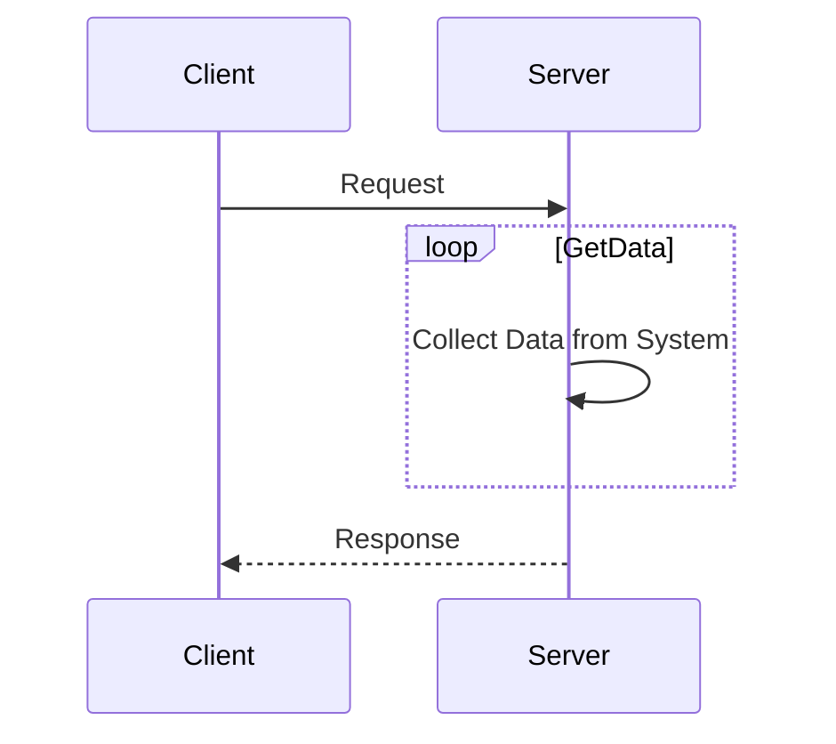
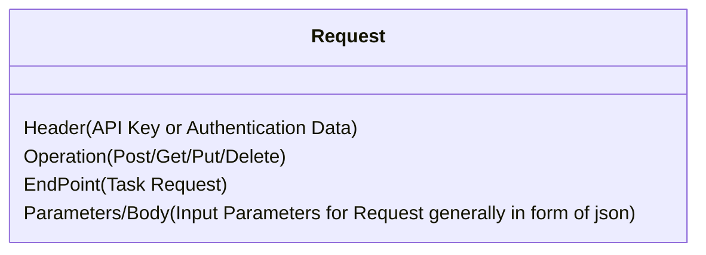
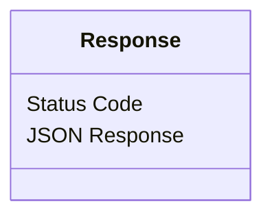

# REST API

REST API is a set of rules standardized to make API.

## Basics

- REST: REpresentational State Transfer
- RESTful: API that uses REST to communicate.
- It is a standardized software architecture type to communicate in the industry.

### Why they are used?

- Simple and Standardized: No worry about formatting. Data is Standardized as JSON.
- Scalable: Easy to grow as application grows.
- Client-Server architecture: Offloads computation to a server rather than on client side.
- Stateless: Does not Store Data on the Client side during request or response.
- Layered System & Cacheibility: The system can save pre calculated results for systems that don't change.

### Operations

HTTP API work on the CRUD Base. REST Equivalent are:

- C: Create -> POST : Add New Data to the Server
- R: Read -> GET : Fetch Data from the server
- U: Update -> PUT : Complete Replacement of resource in server
- D: Delete -> DELETE : Delete Data from the Server
- PATCH : Practical Update a resource in Server

### Structure of REST

#### Request Structure

Sent generally as an HTTP Request in format: `http://<domain>/API/Endpoint`

#### Response

Response generally are HTTP Codes which indicate different responses:

- 2xx: Success
- 4xx: Something wrong with request
- 5xx: Something wrong with server

## Language Specific Guide

### Python

- [REST API Crash Course - Introduction + Full Python API Tutorial](https://youtu.be/qbLc5a9jdXo?si=WO_hBfZmHKi-Q1Zz)

### Rust

- [Rust 🦀 CRUD Rest API - Rust, Postgres, Docker, Docker Compose](https://youtu.be/vhNoiBOuW94?si=tPZjbAcBq6BLbaKC)

### C++

- [Our Adventures With REST API in C++ : Making it Easy - Damien Buhl - CppCon 2021](https://youtu.be/KM9RezKLdVc?si=Nbmjdv8S47GMyvhC)

## Resources
- [What is a REST API?](https://youtu.be/lsMQRaeKNDk?si=9NM1kybCorz84OQT)
- [What Is REST API? Examples And How To Use It: Crash Course System Design #3](https://youtu.be/-mN3VyJuCjM?si=NzJPqY_NIGa95rxY)
- [APIs for Beginners 2023 - How to use an API (Full Course / Tutorial)](https://youtu.be/WXsD0ZgxjRw?si=nwCpAtx0TbiZ0btI)
- Complete Theory: [https://youtube.com/playlist?list=PLWPirh4EWFpGRdVZcQCzeTXFBNSTDAdQX&si=7PRT9aVEE71F2Fpj](https://youtube.com/playlist?list=PLWPirh4EWFpGRdVZcQCzeTXFBNSTDAdQX&si=7PRT9aVEE71F2Fpj)
