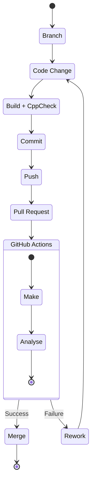

# Design from Scratch using Custom Makefiles and Register Programming

## Project Structure

> Guide: The Best Project
Structure for C/C++/MCU
> 

A good project structure makes it easier to manage files, perform
automations and prepare documentation. The structure suggested here is
[Pitchform
Layout](https://api.csswg.org/bikeshed/?force=1&url=https%3A%2F%2Fraw.githubusercontent.com%2Fvector-of-bool%2Fpitchfork%2Fdevelop%2Fdata%2Fspec.bs).

The project structure is of form:

```
.
├── build
│   ├── bin
│   │   └── a.out
│   └── obj
│       ├── main.o
│       └── module1.o
├── data
├── docs
│   ├── Applications
│   └── Images
│       └── image1.png
├── examples
├── external
│   └── printf
├── extras
├── include
│   ├── app
│   ├── common
│   │   └── defines.cpp
│   ├── drivers
│   ├── module1.cpp
│   └── test
├── libs
├── LICENSE.md
├── Makefile
├── README.md
├── src
│   ├── app
│   ├── common
│   │   └── defines.h
│   ├── drivers
│   ├── main.cpp
│   ├── module1.cpp
│   └── test
├── tests
└── tools
    └── PLACEHOLDER
```

### Tips and Tricks

- Some of the popular available Project Structure:
    - [Pitchfork
    Layout](https://api.csswg.org/bikeshed/?force=1&url=https%3A%2F%2Fraw.githubusercontent.com%2Fvector-of-bool%2Fpitchfork%2Fdevelop%2Fdata%2Fspec.bs)
    - [Canonical
    Project Structure](https://www.open-std.org/jtc1/sc22/wg21/docs/papers/2018/p1204r0.html)
    - [How
    to structure your project](https://cliutils.gitlab.io/modern-cmake/chapters/basics/structure.html)

## Version Control on Projects

> Guide: How I version control
with git (Best Practices)
> 

Version control helps you keep track of changes that you make to the
project. It helps you a restore point in case you mess-up some change
(Believe me that it will happen in almost every project!!) while keeping
track of all the progress you make.

There are many version control options: - Manual Versioning (You make
copies of files with V.. next to the folder name. Kill me but don’t do
this.) - Git - Plastic SCM - Many more..

### Base Rules

There are some rules you should follow for a better version control
over your project: - One Change per commit: Do not overcrowd too much
changes in a single commit. Single change per commit ensures that each
change is seperated and can be individually visited and modified rather
than drastic changes. - Test and build commits: Make sure to automate
tests for each commits or push to github so that the commits can verify
the production. This ensures that wrong changes are not commited. - Good
Commit Messages: Good Commit messages help others (and future you) to
understand what exactly did a change do and how it will affect the
code.

### Tips

- [Guide to
Commit Messages Properly](https://www.conventionalcommits.org/en/v1.0.0/)

## Static Analysis for C/C++

> Guide: Static Analysis for
C/C++ with cppcheck (+Makefile)
> 

A static analysis acts like a proof-reader for your project. It
performs various checks like grammer check in MS Word. It suggest ways
to improve code flow, correct logical errors or reduce non-reachable
parts of code. There are many options to integrate Static Analysis to
your project. One of the opensource available option is
`cppcheck`.

You can integrate `cppcheck` in your Makefile to automate
the checking.

Install `cppcheck` on your system from a new terminal:

```bash
sudo apt-get install cppcheck
```

Amend the Makefile to integrate `cppcheck` as follows:

```
# CPPCHECK
CPPCHECK = cppcheck
CPPCHECK_FLAGS = --quiet --enable=all --error-exitcode=1 --inline-suppr

cppcheck:
    $(CPPCHECK) $(CPPCHECK_FLAGS)\
        -I $(INCLUDE_DIR)\
        $(SOURCES)
```

## Simple CI/CD with GitHub

> Guide: Simple CI/CD with
GitHub Actions and Docker (Compile+Analysis)
> 

### Basics

**CI** stands for **C**ontinuous
**I**ntegration

**CD** stands for **C**ontinuous
**D**elivery/**C**ontinuous
**D**eployment.

CI/CD helps you to automate various processing and set rules to your
git project. You can integrate docker with git to automatically host
changes and build files on GitHub.

**Truly, you can define work of CI/CD as a system that stops
you from merging code that does not work.** Correct code will the
analysed and deployed whereas incorrect code will fail to merge.

Workflow can be as follows:



GitHub Actions runs the Job inside a Linux Virtual Machine. You can
setup a docker container if you want to setup custom commands and
develop cross-platform tools.

### Setup Essentials

You firstly need docker in your system to make a docker image that
can be hosted somewhere for GitHub to fetch during GiHub
Actions(GA).

Install Docker:

```bash
sudo apt-get install docker.io
```

Since we are going to work with this often and this requires admin
access, to avoid `sudo` often, we will create a docker group
and add user to it.

Create Group by name `docker`

```bash
sudo groupadd docker
```

Add User to this group

```bash
sudo usermod -aG docker $USER
newgrp docker
```

### dockerfile

Dockerfile is used to set the base os for the action. It can be used
to install essential dependencies and needed tools.

Now move to the project directory, and create a new folder
`tools` if it does not exist. `cd` into
`tools`.

Create a new file to write the docker commands

```bash
touch dockerfile
```

Make the dockerfile with the following code:

```
FROM ubuntu:23.04
# Install necessary packagesRUN DEBIAN_FRONTEND=noninteractive \    apt-get update \    && apt-get install -y wget bzip2 make unzip cppcheck
# Create a non-root user named "ubuntu"# But put it in root group since GitHub actions need permissions to create temp filesRUN useradd -rm -d /home/ubuntu -s /bin/bash -g root -G sudo \    -u 1001 msp
# Set correct ownership and permissionRUN chown -R msp:root /home/ubuntu
RUN chmod -R 755 /home/ubuntu
USER msp
WORKDIR /home/ubuntu
```

### Code Explaination

Set the base OS Image for docker.

```
FROM ubuntu:23.04
```

This sets the DEBIAN_FRONTEND environment variable to noninteractive,
as explained in the previous responses. It ensures that package
installations will not prompt for user input and will use default
options instead.

```
RUN DEBIAN_FRONTEND=noninteractive
```

This command updates the package lists from the repositories to
ensure you are installing the latest versions of packages.

```
apt-get update
```

Install the essential packages needed for actions. `-y`
flag allows to automatically answer `yes` to any prompts.

```
apt-get install -y wget bzip2 make unzip cppcheck
```

Create a new user named “ubuntu” with the following options: -
`rm`: Remove the user’s home directory if it already exists
(prevents conflicts). - `d /home/ubuntu`: Set the home
directory for the user to /home/ubuntu. - `s /bin/bash`: Set
the default shell for the user to /bin/bash. - `g root`: Add
the user to the “root” primary group. - `G sudo`: Add the
user to the “sudo” supplementary group, which allows the user to execute
commands with elevated privileges when using the sudo command. -
`u 1001`: Set the user ID to 1001 (it’s not recommended to
use the default user ID 1000 because it might conflict with a host user
with the same ID). - `USER msp`: This sets the default user
to “msp” meaning any subsequent commands in the Dockerfile and when the
container runs will execute under this non-root user’s context. This
enhances security by avoiding running processes with root
privileges.

```
RUN useradd -rm -d /home/ubuntu -s /bin/bash -g root -G sudo -u 1001 msp
```

Set the working directory to /home/ubuntu, meaning any commands that
follow will be executed relative to this directory.

```
WORKDIR /home/ubuntu
```

### Build the basic docker image

- `msp430gcc` is the docker container name. You can name it
anything you want.
- `.` is the location of the directory. Since we are
running it from the `tools` directory, we use
`.`

```bash
docker build -t msp430gcc .
```

After the install is complete, look for all available docker images
using:

```bash
docker images
```

The output will be as follows:

```bash
msp430gcc                       latest    5ea5cd5de2fe   5 minutes ago   174MB
ubuntu                          23.04     1ed313b0551f   6 weeks ago     70.3MB
```

`msp430gcc` is our base docker that we will use moving
forward to integrate our toolchains with it.

### Adding MSP430
Toolchain to base docker image

We can choose to fetch the toolchain directly from the TI website
during the CI process but we choose to create a docker image with a
fixed version of MSP430 GCC Toolchain instead because as changes are
made to the toolchain by msp430, the url might change. This might break
the process of fetching. To avoid this issue, we will modify the docker
image of ubuntu to have msp430 toolchain inside to avoid the fetching
issue.

Login into the docker container using:

```bash
docker run --interactive msp430gcc --tty /bin/bash
```

This will load the bash terminal of the docker image just
created.

Open the TI’s website to download the latest version of ToolChain and
Support Files available. At current time, it is: - [Mitto
Systems GCC 64-bit Linux - toolchain only(V9.3.1.11)](https://dr-download.ti.com/software-development/ide-configuration-compiler-or-debugger/MD-LlCjWuAbzH/9.3.1.2/msp430-gcc-9.3.1.11_linux64.tar.bz2) - [Header
and Support Files](https://dr-download.ti.com/software-development/ide-configuration-compiler-or-debugger/MD-LlCjWuAbzH/9.3.1.2/msp430-gcc-support-files-1.212.zip)

Download them into the launch docker container using wget:

```bash
wget https://dr-download.ti.com/software-development/ide-configuration-compiler-or-debugger/MD-LlCjWuAbzH/9.3.1.2/msp430-gcc-support-files-1.212.zip
wget https://dr-download.ti.com/software-development/ide-configuration-compiler-or-debugger/MD-LlCjWuAbzH/9.3.1.2/msp430-gcc-9.3.1.11_linux64.tar.bz2
```

Unzip the files:

```bash
tar xvjf msp430-gcc-9.3*unzip msp430-gcc-support*
```

Move the `include` directory from MSP430 Support files to
`include` directory of MSP430 toolchain.

```bash
mv msp430-gcc-support-files/include/* msp430-gcc-9.3.1.11_linux64/include/
```

Create the `dev/tools/` directory like we have in our
computer for toolchain to be placed:

```bash
mkdir -p dev/tools
mv msp430-gcc-9.3.1.11_linux64 dev/tools/msp430-gcc
```

Clear all extra files and exit container:

```bash
rm -rf msp*exit
```

Find the container ID of this docker session and commit it into a new
image:

```bash
docker ps -a
```

The output of all sessions will be as follows:

```bash
CONTAINER ID   IMAGE          COMMAND                  CREATED             STATUS                         PORTS     NAMES
090b39853eec   msp430gcc      "/bin/bash"              4 minutes ago       Exited (0) 2 seconds ago                 sleepy_vaughan
ec716a782125   msp430gcc      "/bin/bash"              43 minutes ago      Exited (0) 40 minutes ago                funny_tu
d31d9b3d22fe   87ada84a26e8   "/bin/bash"              About an hour ago   Exited (0) About an hour ago             laughing_jackson
71e460a0c533   72c77c8a3a9e   "/bin/bash"              About an hour ago   Exited (2) About an hour ago             upbeat_kare
99c1ee5b66eb   89d2dbc25de6   "/bin/sh -c 'useradd…"   About an hour ago   Exited (9) About an hour ago             pedantic_shannon
b0827366987b   6fee5ce39d5d   "/bin/sh -c 'useradd…"   2 hours ago         Exited (9) 2 hours ago                   exciting_keller
```

Save the topmost session as new docker image. Write the name of new
docker image in following format:
`<docker-hub-username>/<toolchain-version>`. This
will allow for a simple push to the docker hub ahead.

```bash
docker commit 090b39853eec parth2007/msp430-gcc-9.3.1.11
```

Check for the new docker image by using:

```bash
docker images
```

### Pushing to Docker Hub

For Github to fetch this image, we need to make sure that this is
available somewhere to access it. We will be placing this docker image
at [dockerhub](https://hub.docker.com/).

1. Create Account/Login into docker hub.
2. Configure connection to docker hub on your terminal using:

```bash
docker login
```

Enter the `USER ID` and `PASSWORD` from docker
hub to login into docker hub from terminal. 3. After successful login,
push the image to docker hub by:
`bash   docker push parth2007/msp430-gcc-9.3.1.11:latest`

This will take some time but you will be able to push the image to
the docker hub to access it from anywhere you want.

### Creating CI System

GitHub requires the CI File to be stored at a specific location
`<root>/.github/workflows`.

Make the `ci.yml` from project root as follows:

```bash
mkdir -p .github/workflows -ptouch .github/workflows/ci.yml
```

Open the ci file and create the ci process as follows:

```yaml
on: [push]jobs:  build_and_static_analysis:    runs-on: ubuntu-latest    container:      image: parth2007/msp430-gcc-9.3.1.11    steps:      - name: Checkout the repository        uses: actions/checkout@v3      - run: make      - run: make cppcheck
```

This GitHub Actions CI (Continuous Integration) configuration file
(ci.yml) automates the build and static analysis process for a
repository. Let’s break down the contents of the file:

```yaml
on: [push]
```

This line specifies the trigger event that activates the CI workflow.
In this case, the workflow will be triggered whenever there is a “push”
event to the repository. This means that the CI process will run
whenever code is pushed to the repository.

```yaml
jobs:  build_and_static_analysis:    runs-on: ubuntu-latest    container:      image: parth2007/msp430-gcc-9.3.1.11    steps:      - name: Checkout the repository        uses: actions/checkout@v3      - run: make      - run: make cppcheck
```

This section defines the actual CI job named
“build_and_static_analysis.” It specifies the operating environment for
the job, which is “ubuntu-latest,” meaning the CI process will run on
the latest version of Ubuntu available in the GitHub Actions
environment.

The `container` section allows the job to run inside a
Docker container with the specified image
(`parth2007/msp430-gcc-9.3.1.11`). This image contains the
necessary tools and dependencies required for building and analyzing
MSP430 projects using GCC 9.3.1.11.

The `steps` section lists the individual tasks that the CI
job will execute:

1. `Checkout the repository`: This step uses the
`actions/checkout` GitHub Action to fetch the latest code
from the repository. It ensures that the CI process has access to the
repository’s source code.
2. `run: make`: This step executes the `make`
command. The `make` command is commonly used to build
projects based on Makefiles. It will likely build the MSP430
project.
3. `run: make cppcheck`: This step executes the
`make cppcheck` command. It implies that there is a target in
the project’s Makefile called `cppcheck`, which likely runs
the static code analysis tool `cppcheck`. Static code
analysis helps identify potential bugs, coding issues, and other
problems in the codebase without actually executing the code.

Overall, this CI workflow automates the process of building the
MSP430 project and performing static code analysis on it whenever
changes are pushed to the repository. The results of the CI process can
be viewed in the GitHub Actions tab of the repository. If there are any
build errors or static analysis issues, they will be reported in the CI
log, allowing the developers to take corrective actions.

### Adding Branch Protection
Rules

Branch Rules allow you to set a particular set of behavior for
developers to follow so that you can increase safety of the production
or main branch. One of those behaviors is to create branches from the
`main` everytime a change to the design/code needs to be
made. This ensures that even if you change breaks the system or
introduces a new bug, anyone using or code from the main branch can
avoid any issues related to the changes you just made.

[https://scribehow.com/embed/Step-by-Step_Guide_to_Adding_Branch_Protection_Rules_on_GitHub__jhhd0RRtTxujJiPrOpVHig](https://scribehow.com/embed/Step-by-Step_Guide_to_Adding_Branch_Protection_Rules_on_GitHub__jhhd0RRtTxujJiPrOpVHig)

Your complete ci is going to fail after this because the Makefile
still points towards the directory address of the toolchain in your
computer rather than docker workchain. We need to ammend that.

### Ammend Makefile for CI

Modify the Makefile to change the path of toolchain. This can be done
by introducing a variable that takes `TOOLS_PATH` as
input.

```
TOOLS_DIR = $(TOOLS_PATH)
$(info $(TOOLS_DIR))
MSP430_ROOT_DIR = $(TOOLS_DIR)/msp430-gcc
MSP430_INCLUDE_DIR = $(MSP430_ROOT_DIR)/include/
MSP430_LINKER_DIR = $(MSP430_ROOT_DIR)/include/
INCLUDE_DIR = $(MSP430_INCLUDE_DIR)
LIB_DIR = $(MSP430_LINKER_DIR)
BUILD_DIR = build
OBJ_DIR = $(BUILD_DIR)/obj
BIN_DIR = $(BUILD_DIR)/bin
```

We also need to make changed to the ci.yml so we can pass the
TOOLS_PATH as input to it.

```yaml
on: [push]jobs:  build_and_static_analysis:    runs-on: ubuntu-latest    container:      image: parth2007/msp430-gcc-9.3.1.11    steps:      - name: Checkout the repository        uses: actions/checkout@v3      - run: TOOLS_PATH=/home/ubuntu/dev/tools make      - run: TOOLS_PATH=/home/ubuntu/dev/tools make cppcheck
```

After making these changes, push your code to GitHub to start the
implementation.

### How to use it moving
forwards?

The process moving forwards is simple: 1. Create a new local branch.
2. Edit the code to make the changes needed. 3. Test the changes at
local level using your makefile. 4. Commit and Push the code to github
using: `bash   git push -u origin <branch-name>` 5.
Accept the pull request on your mail branch. A CI Action will run before
the merge can be accepted. 6. If the CI Action is successful, confirm
merging with main branch. 7. Delete the branch both at local and remote
level. 8. Perform Git Pull on local branch `main`.

### Resources

Complete Guide to CI/CD from GitHub can be found at: - [CI/CD: The what, why, and
how](https://resources.github.com/ci-cd/) - [Learn
GitHub Actions](https://docs.github.com/en/actions/learn-github-actions)

## Documentation and Clang

> Guide: Documentation and Clang
format
> 

### Documentaion

A good documentation README of a project contains following items: -
Project Name on Top. - Photos Showing the Project/Functionality. - A
Brief Writeup of how the project works. - A Small Write up on what
technology and design procedure have been used in project. - Project
Directory Structure showing how the files are organized. - Guide on how
to build/run the project. - Small explaination on how to the project
automation files work. - Write-up on any Tests present. - Commit Guide
for a new change - Schematic Diagram of the Hardware if any. - Guide on
how to generate/fetch Bill of Materials. - Software Architecture if
any

### Clang-Formatting

Most IDE that you use can install dependencies that can format code
for you. But if you are working with multiple different systems,
different IDEs or Formatters can format code in different ways. To
create a uniform formatting pattern, external/manual formatting agents
can be used.

**clang-format** is one of the commonly used free tool
available out there which can be used to set code formatting rules.

Install **clang-format** on your system using:

```bash
sudo apt install clang-format
```

After the install, you need to create a `.clang-format`
file which holds all the rules for Formatting. There are various
available formats of formatting availale: - `LLVM` A style
complying with the LLVM coding standards - `Google` A style
complying with Google’s C++ style guide - `Chromium` A style
complying with Chromium’s style guide - `Mozilla` A style
complying with Mozilla’s style guide - `WebKit` A style
complying with WebKit’s style guide - `Microsoft` A style
complying with Microsoft’s style guide - `GNU` A style
complying with the GNU coding standards

Create the file in required format as follows:

```bash
clang-format -style=GNU -dump-config > .clang-format
```

This will create a `.clang-format` as per the coding
standard available from these groups.

You can format a file using the command:

```bash
clang-format -i main.c
```

As you might have noticed, this is going to be tiring if you do this
for every file available, So to automate formatting on all files, you
can create a PHONY in Makefile.

```
FORMATTER: clang-format

.PHONY: format

format:
  @$(FORMATTER) -i $(SOURCES)
```

Now, you can format all files by simply calling:

```bash
make format
```

### Integrating Formatting with
CI/CD

clang-format can be integrated in CI using docker.

Update the `dockerfile` to install clang-format.

```
# Install necessary packagesRUN DEBIAN_FRONTEND=noninteractive \    apt-get update \    && apt-get install -y wget bzip2 make unzip cppcheck clang-format git
```

Follow the CI/CD Guide to update the image on dockerhub with this
clang-format.

Update the CI.yml to run a formatting check task:

```yaml
- run: make format && git diff --quiet- run: TOOLS_PATH=/home/ubuntu/dev/tools make- run: TOOLS_PATH=/home/ubuntu/dev/tools make cppcheck
```

### Resources

- [Clang Official
Documentation](https://clang.llvm.org/docs/index.html)
- Lei Mao’s Log Book: [Format
C/C++ Using Clang-format](https://leimao.github.io/blog/Clang-Format-Quick-Tutorial/)
- Clang Official Documentation: [Configurable
Format Style Options](https://clang.llvm.org/docs/ClangFormatStyleOptions.html#configurable-format-style-options)
