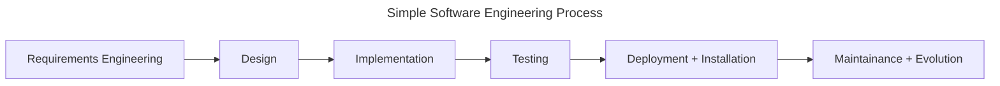

# Requirements Engineering

## Overview

A typical Development Cycle for a product is as follows:

1. Taking the requirements from Stakeholder
2. Move to software design
3. Code
4. Test and Integrate
5. Deploy
6. Maintain

Definition: RE is a gateway to translate information between non-technical people (Stakeholders) and Technical People(Developers).

The main reason the process often takes long is the lack of proper requirements engineering. A proper requirement engineering contains:

1. Knowning and breaking down what people want in system.
2. Wishes that they may have but are not aware of it.
3. Understanding and figuring out what they need but aren't actively aware of it.
4. Constraints that technical environment, software integration and deployment brings.

Different ways to write requirements:

- Natural Language RE
- Modeled/Model-based RE
    - Graphs
        - UML Diagrams
    - Formulas
        - Mathematical Representation
    - Code
        - Pseudocode
        - Early Prototyping
- Artifact-based RE
    - Goals
    - Stakeholders
    - Constraints

## Process of Software Engineering

## Resources

 - Youtube Series: [Requirements Engineering](https://youtube.com/playlist?list=PLUgFMzuE8lQDeixpbP3s6EyQx8PiNdeQL&si=jyPeavHLOGekxM8H)
 - Course Material: [Requirements Engineering, CSU Long Beach, Penzenstadler](http://www.foss2serve.org/index.php/Requirements_Engineering,_CSU_Long_Beach,_Penzenstadler)
